# Complete System Architecture Documentation
## Verbal Insights Platform - Updated with Firebase Storage & Media Processing

## 📚 Table of Contents
- [🏗️ System Overview](#system-overview)
- [🔧 Technology Stack](#technology-stack)
- [📦 Application Architecture](#application-architecture)
- [🎯 Data Flow Diagrams](#data-flow-diagrams)
- [🔐 Security Architecture](#security-architecture)
- [📊 Database Schema](#database-schema)
- [🚀 Deployment Architecture](#deployment-architecture)
- [🧪 Testing Strategy](#testing-strategy)

---

## 🏗️ System Overview

The Verbal Insights platform is a comprehensive AI-powered interview assessment system built with Next.js 15, Firebase, and Google Gemini AI. The architecture supports both traditional interviews (JDT) and situational judgment tests (SJT) with advanced media processing capabilities.

### Core Capabilities
- 🎤 **Real-time Audio Recording** with progressive upload
- 🤖 **AI-Powered Analysis** using Google Gemini 2.0 Flash
- 📊 **Comprehensive Reporting** with detailed candidate evaluation
- 👥 **Role-Based Access Control** (Admin, Super Admin, Candidate)
- 🌐 **CORS-Proof Media Handling** with 5-layer download strategy
- 🎵 **Audio Extraction** from videos using client-side FFmpeg.js processing
- 📱 **Responsive Design** optimized for all devices
- 🔄 **Real-time Synchronization** across multiple devices

---

## 🔧 Technology Stack

### Frontend Layer
```typescript
- Framework: Next.js 15 (App Router)
- Language: TypeScript 5.x
- UI Library: React 18 + shadcn/ui components
- Styling: Tailwind CSS 3.x
- State Management: React Context + Custom Hooks
- Form Handling: React Hook Form + Zod validation
- Media Processing: FFmpeg.js for client-side audio extraction
```

### Backend Services
```typescript
- AI Engine: Google Genkit + Gemini 2.0 Flash
- Database: Firebase Firestore + localStorage fallback
- Storage: Firebase Storage with CORS proxy
- Authentication: Firebase Auth + Custom role system
- API Routes: Next.js API Routes (App Router)
```

### Infrastructure & Deployment
```typescript
- Primary Hosting: Vercel (Edge Functions)
- Media Storage: Firebase Storage
- CDN: Vercel Edge Network
- Monitoring: Vercel Analytics + Custom logging
- Security: Firebase Security Rules + CORS configuration
```

---

## 📦 Application Architecture

### 1. High-Level System Architecture

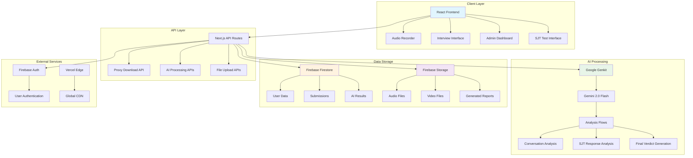

### 2. Component Architecture

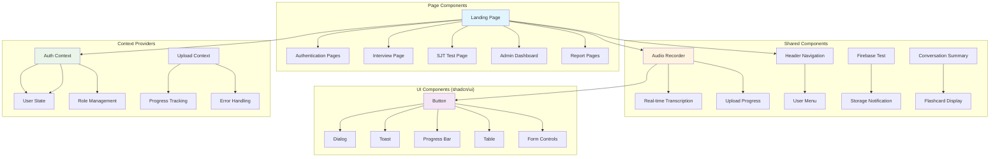

### 3. File Structure Overview

```
📦 Verbal Insights Platform
├── 🏠 src/app/                          # Next.js App Router pages
│   ├── 📄 page.tsx                      # Landing page
│   ├── 🔐 login/page.tsx                # Authentication
│   ├── 🔐 register/page.tsx             # User registration
│   ├── 🎤 interview/page.tsx            # JDT interview interface
│   ├── 📝 sjt/page.tsx                  # SJT test interface
│   ├── 👥 admin/                        # Admin dashboard
│   │   ├── 📊 submissions/page.tsx      # Submission management
│   │   └── 👤 users/page.tsx            # User management
│   ├── 📈 report/[id]/page.tsx          # Individual reports
│   └── 🌐 api/                          # API routes
│       ├── 🔄 proxy-download/route.ts   # CORS bypass proxy
│       ├── 📤 upload/route.ts           # File upload handling
│       └── 🤖 ai/                       # AI processing endpoints
├── 🧩 src/components/                   # Reusable components
│   ├── 🎙️ audio-recorder.tsx           # Recording component
│   ├── 📊 upload-progress.tsx          # Progress tracking
│   ├── 🔄 conversation-summary.tsx     # AI analysis display
│   ├── 📱 header.tsx                   # Navigation header
│   ├── 🎯 interview/                   # Interview-specific components
│   ├── 📝 sjt/                         # SJT-specific components
│   └── 🎨 ui/                          # shadcn/ui components
├── 🎣 src/hooks/                        # Custom React hooks
│   ├── 📤 use-submission-upload.ts     # Upload management
│   ├── 📊 use-upload-progress.ts       # Progress tracking
│   ├── 🎯 use-throttled-progress.ts    # Performance optimization
│   └── 📱 use-mobile.tsx               # Responsive helpers
├── 🔧 src/lib/                          # Utility libraries
│   ├── 🔥 firebase.ts                  # Firebase configuration
│   ├── 📊 database.ts                  # Database operations
│   ├── 📤 media-storage.ts             # Storage operations
│   ├── 🎵 audio-extractor.ts           # FFmpeg.js audio extraction utility
│   ├── 📈 upload-progress-calculator.ts # Progress calculations
│   ├── ⚠️ upload-error-handler.ts      # Error management
│   └── 🧮 utils.ts                     # General utilities
├── 🤖 src/ai/                           # AI processing flows
│   ├── ⚙️ genkit.ts                    # Genkit configuration
│   ├── 🔧 dev.ts                       # Development tools
│   ├── 🎯 flows/                       # AI processing flows
│   │   ├── 💬 analyze-conversation.ts   # Interview analysis
│   │   ├── 📝 analyze-sjt-response.ts   # SJT analysis
│   │   └── ⚖️ generate-final-verdict.ts # Final evaluation
│   └── 🛠️ tools/                       # AI helper tools
│       └── 📧 email-tool.ts            # Email notifications
├── 🏗️ src/contexts/                    # React contexts
│   ├── 🔐 auth-context.tsx             # Authentication state
│   └── 📤 upload-context.tsx           # Upload management
└── 📝 src/types/                       # TypeScript definitions
    └── 📄 index.ts                     # Type definitions
```

---

## 🎯 Data Flow Diagrams

### 1. Interview Submission Flow

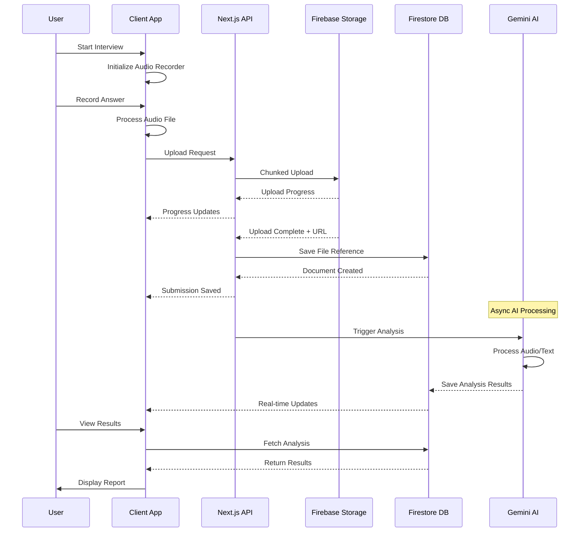

### 2. Admin Download Flow

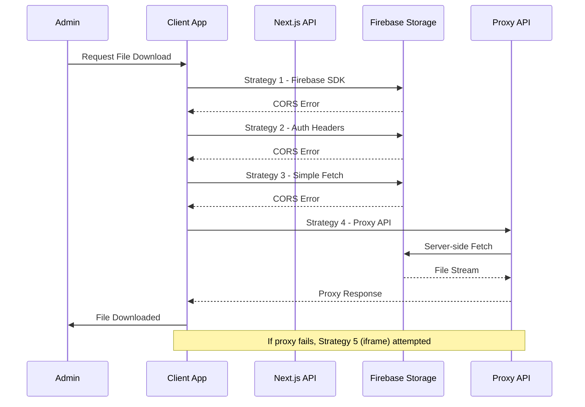

### 3. Real-time Progress Tracking

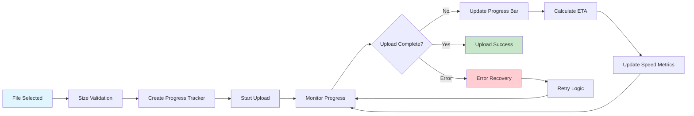

---

## 🔐 Security Architecture

### 1. Authentication & Authorization Flow

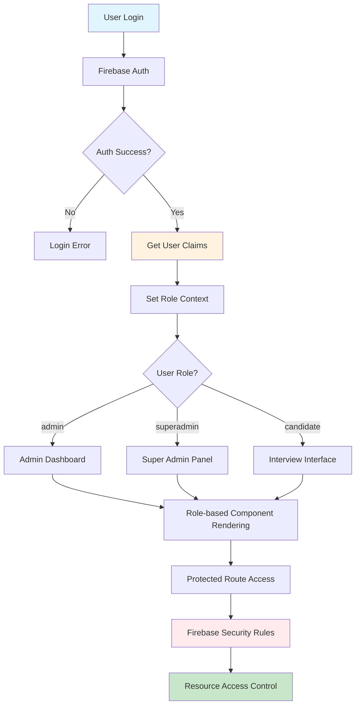

### 2. Firebase Security Rules Architecture

```javascript
// Firestore Security Rules
rules_version = '2';
service cloud.firestore {
  match /databases/{database}/documents {
    // User-specific data access
    match /users/{userId} {
      allow read, write: if request.auth != null && 
        request.auth.uid == userId;
    }
    
    // Submission access control
    match /submissions/{submissionId} {
      allow create: if request.auth != null;
      allow read, update: if request.auth != null && (
        resource.data.userId == request.auth.uid ||
        request.auth.token.role in ['admin', 'superadmin']
      );
    }
    
    // Admin-only configuration access
    match /config/{configId} {
      allow read, write: if request.auth != null && 
        request.auth.token.role in ['admin', 'superadmin'];
    }
  }
}

// Storage Security Rules
service firebase.storage {
  match /b/{bucket}/o {
    // User submission uploads
    match /submissions/{userId}/{allPaths=**} {
      allow read, write: if request.auth != null && 
        request.auth.uid == userId;
      allow read: if request.auth != null && 
        request.auth.token.role in ['admin', 'superadmin'];
    }
    
    // Profile image management
    match /user_avatars/{userId} {
      allow read, write: if request.auth != null && 
        request.auth.uid == userId;
    }
  }
}
```

### 3. CORS & Proxy Security

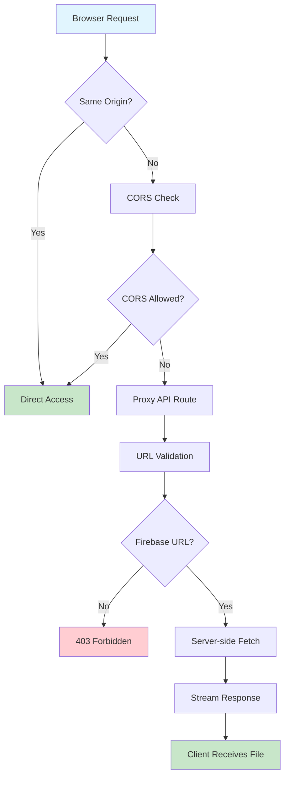

---

## 📊 Database Schema

### 1. Firestore Collections Structure

```typescript
// Database Schema Overview
interface DatabaseSchema {
  // User management
  users: {
    [userId: string]: User;
  };
  
  // Interview submissions
  submissions: {
    [submissionId: string]: Submission;
  };
  
  // System configuration
  config: {
    app: AppConfig;
    ai: AIConfig;
    storage: StorageConfig;
  };
  
  // Analytics and reporting
  analytics: {
    [analyticsId: string]: AnalyticsData;
  };
  
  // Audit logs
  audit_logs: {
    [logId: string]: AuditLogEntry;
  };
}

// Detailed User Document
interface User {
  uid: string;
  email: string;
  displayName: string;
  role: 'admin' | 'superadmin' | 'candidate';
  createdAt: Timestamp;
  lastLogin: Timestamp;
  profileImage?: string;
  
  // User preferences
  settings: {
    notifications: boolean;
    theme: 'light' | 'dark' | 'system';
    language: string;
    timezone: string;
  };
  
  // Activity tracking
  activity: {
    lastSubmission?: Timestamp;
    totalSubmissions: number;
    averageScore?: number;
  };
  
  // Personal information (optional)
  profile?: {
    firstName: string;
    lastName: string;
    company?: string;
    position?: string;
    experience?: string;
  };
}

// Comprehensive Submission Document
interface Submission {
  id: string;
  userId: string;
  type: 'jdt' | 'sjt';
  status: 'pending' | 'processing' | 'completed' | 'failed' | 'archived';
  
  // Timestamps
  createdAt: Timestamp;
  startedAt?: Timestamp;
  completedAt?: Timestamp;
  processedAt?: Timestamp;
  
  // Job/Position details (for JDT)
  jobDetails?: {
    title: string;
    description: string;
    requirements: string[];
    experience: string;
    location: string;
  };
  
  // Interview questions and responses
  questions: {
    question: string;
    response?: string;
    audioFile?: string;
    videoFile?: string;
    duration?: number;
    recordingQuality?: number;
  }[];
  
  // Media file references
  mediaFiles: {
    [key: string]: {
      storageUrl: string;
      downloadUrl: string;
      filename: string;
      size: number;
      mimeType: string;
      uploadedAt: Timestamp;
    };
  };
  
  // AI Analysis Results
  analysis?: {
    overallScore: number;
    scores: {
      communication: number;
      technical: number;
      softSkills: number;
      culturalFit: number;
      leadership?: number;
      problemSolving?: number;
    };
    
    // Detailed feedback
    feedback: {
      strengths: string[];
      improvements: string[];
      recommendations: string[];
      detailedAnalysis: string;
    };
    
    // AI processing metadata
    aiMetadata: {
      model: string;
      processingTime: number;
      confidence: number;
      tokensUsed: number;
      processingDate: Timestamp;
    };
    
    // Final recommendation
    recommendation: 'hire' | 'consider' | 'reject';
    recommendationReason: string;
  };
  
  // Upload and processing metadata
  metadata: {
    sessionId: string;
    userAgent: string;
    ipAddress?: string;
    deviceInfo?: string;
    
    // Upload tracking
    uploadProgress: {
      [filename: string]: {
        progress: number;
        speed: number;
        eta: number;
        status: 'pending' | 'uploading' | 'completed' | 'failed';
      };
    };
    
    // Processing logs
    processingLogs: {
      timestamp: Timestamp;
      stage: string;
      message: string;
      level: 'info' | 'warning' | 'error';
    }[];
    
    // Quality metrics
    qualityMetrics?: {
      audioQuality: number;
      backgroundNoise: number;
      speechClarity: number;
      recordingStability: number;
    };
  };
}

// Application Configuration
interface AppConfig {
  version: string;
  features: {
    realTimeTranscription: boolean;
    progressiveUpload: boolean;
    downloadFallbacks: boolean;
    aiAnalysis: boolean;
    reportGeneration: boolean;
  };
  
  limits: {
    maxFileSize: number;        // bytes
    maxRecordingTime: number;   // seconds
    maxSubmissionsPerUser: number;
    maxConcurrentUploads: number;
  };
  
  ai: {
    provider: 'gemini' | 'openai' | 'claude';
    model: string;
    maxTokens: number;
    temperature: number;
    timeout: number;
  };
  
  storage: {
    provider: 'firebase' | 'aws' | 'gcp';
    bucket: string;
    region: string;
    compressionEnabled: boolean;
    retentionDays: number;
  };
}
```

### 2. Firebase Storage Structure

```
📦 Firebase Storage (gs://your-project.appspot.com)
├── 📁 submissions/
│   ├── 📁 {userId}/
│   │   ├── 📁 {submissionId}/
│   │   │   ├── 🎥 Q1_video.webm               # 1-5MB typical
│   │   │   ├── 🎥 Q2_video.webm               # Video responses
│   │   │   ├── 🎥 Q3_video.webm               # Per question
│   │   │   ├── 🎥 Q4_video.webm               # WebM format
│   │   │   ├── 🎙️ full_interview.wav         # Complete audio
│   │   │   ├── 🎙️ Q1_audio.wav               # Individual Q audio
│   │   │   ├── 📄 transcript.txt             # Generated transcript
│   │   │   └── 📊 metadata.json              # Upload metadata
│   │   └── 📁 archived/                      # Processed submissions
│   └── 📁 temp/                              # Temporary uploads
├── 📁 user_profiles/
│   ├── 📁 avatars/                           # Profile pictures
│   └── 📁 documents/                         # Resumes, certificates
├── 📁 reports/
│   ├── 📁 individual/                        # Per-candidate reports
│   ├── 📁 bulk/                              # Batch exports
│   └── 📁 analytics/                         # System analytics
├── 📁 assets/
│   ├── 📁 templates/                         # Report templates
│   ├── 📁 branding/                          # Company assets
│   └── 📁 static/                            # Public assets
└── 📁 backups/
    ├── 📁 submissions/                       # Data backups
    └── 📁 configurations/                    # Config backups
```

---

## 🚀 Deployment Architecture

### 1. Production Deployment Flow

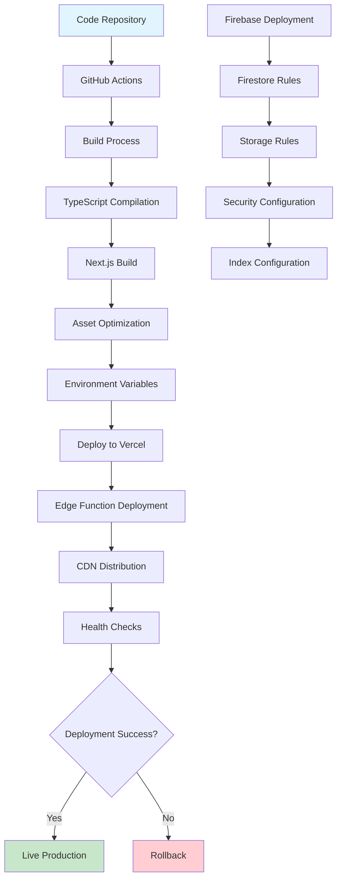

### 2. Infrastructure Overview

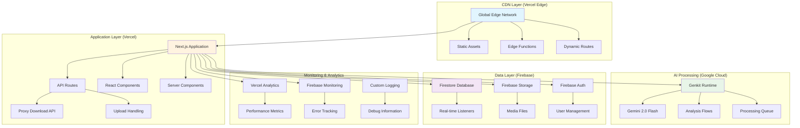

### 3. Environment Configuration

```bash
# Production Environment Variables (Vercel)
NEXT_PUBLIC_FIREBASE_API_KEY="prod-api-key"
NEXT_PUBLIC_FIREBASE_AUTH_DOMAIN="trajectorie-vibe.firebaseapp.com"
NEXT_PUBLIC_FIREBASE_PROJECT_ID="trajectorie-vibe"
NEXT_PUBLIC_FIREBASE_STORAGE_BUCKET="trajectorie-vibe.appspot.com"
NEXT_PUBLIC_FIREBASE_MESSAGING_SENDER_ID="123456789"
NEXT_PUBLIC_FIREBASE_APP_ID="1:123456789:web:abcdef"

# AI Configuration
GEMINI_API_KEY="gemini-production-key"
GENKIT_ENV="production"

# Application Settings
NODE_ENV="production"
NEXT_PUBLIC_APP_ENV="production"
NEXT_PUBLIC_ENABLE_ANALYTICS="true"
NEXT_PUBLIC_DEBUG_MODE="false"

# Security Settings
NEXT_PUBLIC_CORS_ORIGINS="https://trajectorie-vibe.vercel.app"
NEXT_PUBLIC_API_RATE_LIMIT="100"
```

---

## 🧪 Testing Strategy

### 1. Testing Pyramid

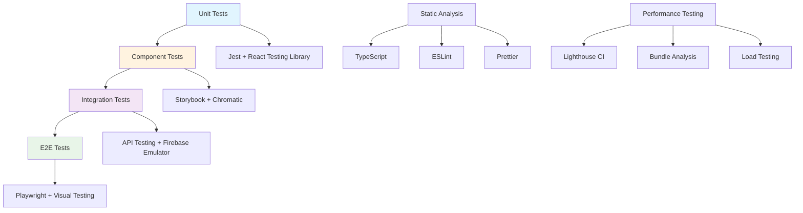

### 2. Test Coverage Areas

```typescript
// Test Configuration Overview
describe('Testing Strategy', () => {
  describe('Unit Tests', () => {
    test('Utility functions', () => {
      // Test pure functions and calculations
      expect(calculateUploadProgress(50, 100)).toBe(50);
    });
    
    test('Type guards and validators', () => {
      // Test TypeScript type safety
      expect(isValidFirebaseUrl('https://firebasestorage...')).toBe(true);
    });
  });
  
  describe('Component Tests', () => {
    test('Audio recorder component', () => {
      // Test recording functionality
      render(<AudioRecorder onRecordingComplete={mockFn} />);
      // Test interactions and state changes
    });
    
    test('Upload progress component', () => {
      // Test progress display and updates
      render(<UploadProgress progress={50} />);
      expect(screen.getByText('50%')).toBeInTheDocument();
    });
  });
  
  describe('Integration Tests', () => {
    test('File upload flow', async () => {
      // Test complete upload process
      const file = new File(['test'], 'test.webm');
      const url = await uploadFile(file, 'test/path');
      expect(url).toContain('firebasestorage');
    });
    
    test('Download strategies', async () => {
      // Test fallback download mechanisms
      const blob = await downloadFromFirebaseStorage(testUrl);
      expect(blob.size).toBeGreaterThan(0);
    });
  });
  
  describe('E2E Tests', () => {
    test('Complete interview flow', async () => {
      // Test full user journey
      await page.goto('/interview');
      await page.click('[data-testid="start-interview"]');
      await page.waitForSelector('[data-testid="recording-active"]');
      // Continue testing complete flow
    });
  });
});
```

### 3. Continuous Integration Pipeline

```yaml
# .github/workflows/ci.yml
name: CI/CD Pipeline

on:
  push:
    branches: [main, develop]
  pull_request:
    branches: [main]

jobs:
  test:
    runs-on: ubuntu-latest
    steps:
      - uses: actions/checkout@v3
      - uses: actions/setup-node@v3
        with:
          node-version: '18'
          cache: 'npm'
      
      - name: Install dependencies
        run: npm ci
      
      - name: Run TypeScript check
        run: npm run typecheck
      
      - name: Run unit tests
        run: npm run test:unit
      
      - name: Run integration tests
        run: npm run test:integration
        env:
          FIREBASE_PROJECT_ID: ${{ secrets.FIREBASE_PROJECT_ID }}
      
      - name: Run E2E tests
        run: npm run test:e2e
      
      - name: Upload coverage
        uses: codecov/codecov-action@v3

  build:
    needs: test
    runs-on: ubuntu-latest
    steps:
      - uses: actions/checkout@v3
      - uses: actions/setup-node@v3
        with:
          node-version: '18'
          cache: 'npm'
      
      - name: Install dependencies
        run: npm ci
      
      - name: Build application
        run: npm run build
        env:
          NEXT_PUBLIC_FIREBASE_API_KEY: ${{ secrets.FIREBASE_API_KEY }}
      
      - name: Run lighthouse CI
        run: npm run lighthouse
```

---

## 📈 Performance & Monitoring

### 1. Performance Optimization Strategy

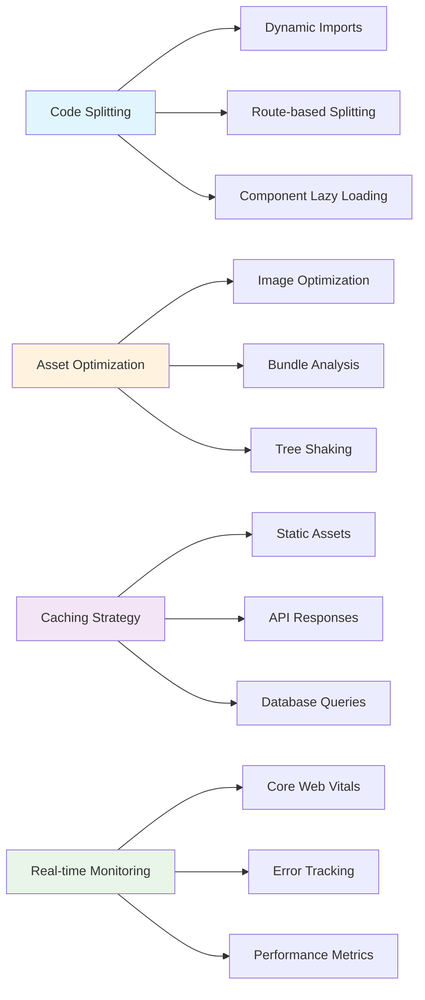

### 2. Monitoring Dashboard

```typescript
// Performance Monitoring Configuration
interface MonitoringConfig {
  // Core Web Vitals tracking
  vitals: {
    fcp: number;        // First Contentful Paint
    lcp: number;        // Largest Contentful Paint
    fid: number;        // First Input Delay
    cls: number;        // Cumulative Layout Shift
    ttfb: number;       // Time to First Byte
  };
  
  // Custom metrics
  custom: {
    uploadSpeed: number;
    downloadSpeed: number;
    aiProcessingTime: number;
    errorRate: number;
    userSatisfaction: number;
  };
  
  // Error tracking
  errors: {
    javascript: ErrorLog[];
    network: NetworkError[];
    upload: UploadError[];
    download: DownloadError[];
  };
}
```

---

## 🎉 Summary

This comprehensive architecture documentation covers:

✅ **Complete System Overview** - Technology stack and component relationships
✅ **Detailed Application Architecture** - File structure and component hierarchy  
✅ **Advanced Data Flow** - Sequential diagrams and process flows
✅ **Robust Security Model** - Authentication, authorization, and CORS handling
✅ **Comprehensive Database Schema** - Firestore and Storage structure
✅ **Production Deployment** - Infrastructure and environment configuration
✅ **Testing Strategy** - Multi-layer testing approach with CI/CD
✅ **Performance Monitoring** - Optimization and real-time tracking

The platform is production-ready with enterprise-grade architecture, security, and monitoring capabilities.
