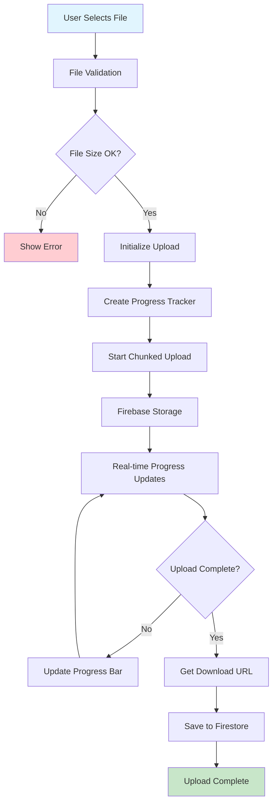
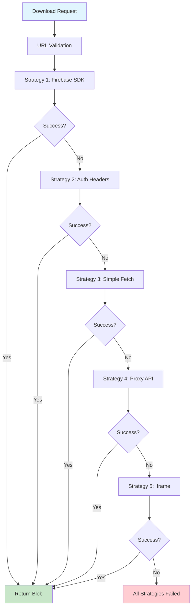
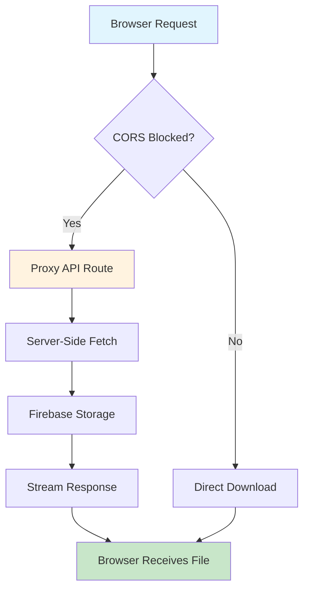
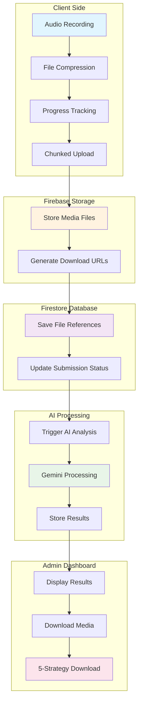
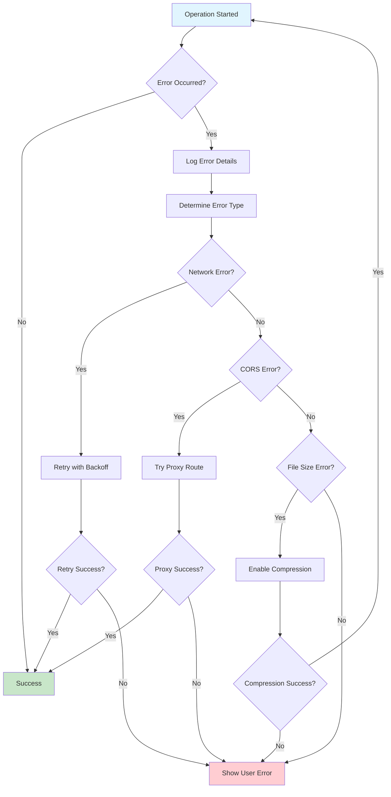

# Firebase Storage & Media Architecture Documentation

## 📚 Table of Contents
- [🏗️ Overview](#overview)
- [🔧 Firebase Storage Setup](#firebase-storage-setup)
- [🌐 CORS Configuration](#cors-configuration)
- [📦 Progressive Upload System](#progressive-upload-system)
- [🔄 Download Architecture](#download-architecture)
- [📊 Data Storage Structure](#data-storage-structure)
- [🔐 Security Rules](#security-rules)
- [🎯 Architecture Diagrams](#architecture-diagrams)

---

## 🏗️ Overview

The Verbal Insights platform implements a sophisticated media storage and processing system using Firebase Storage with advanced CORS handling, progressive uploads, and multi-strategy download capabilities.

### Key Features
- ✅ **Progressive Upload System** - Chunked uploads with real-time progress tracking
- ✅ **Multi-Strategy Downloads** - 5-layer fallback system for maximum compatibility
- ✅ **CORS-Proof Architecture** - Server-side proxy for complete CORS bypass
- ✅ **Real-time Progress Tracking** - Upload/download progress with ETA calculations
- ✅ **Comprehensive Error Handling** - Detailed error logging and recovery strategies
- ✅ **Type-Safe Implementation** - Full TypeScript integration with proper error boundaries

---

## 🔧 Firebase Storage Setup

### 1. Firebase Project Configuration

```bash
# Install Firebase CLI
npm install -g firebase-tools

# Login to Firebase
firebase login

# Initialize Firebase in your project
firebase init storage
```

### 2. Storage Bucket Setup

**In Firebase Console:**
1. Navigate to **Storage** → **Get Started**
2. Choose **Start in production mode**
3. Select storage location (recommend: `us-central1`)
4. Note your storage bucket URL: `your-project.appspot.com`

### 3. Environment Variables

```bash
# .env.local
NEXT_PUBLIC_FIREBASE_STORAGE_BUCKET="your-project.appspot.com"
NEXT_PUBLIC_FIREBASE_API_KEY="your-api-key"
NEXT_PUBLIC_FIREBASE_AUTH_DOMAIN="your-project.firebaseapp.com"
NEXT_PUBLIC_FIREBASE_PROJECT_ID="your-project-id"
NEXT_PUBLIC_FIREBASE_MESSAGING_SENDER_ID="your-sender-id"
NEXT_PUBLIC_FIREBASE_APP_ID="your-app-id"
```

---

## 🌐 CORS Configuration

### Problem Solved
Firebase Storage has strict CORS policies that prevent direct browser downloads of media files, causing the "All download strategies failed" error.

### Solution: Multi-Layer CORS Handling

#### 1. Firebase Storage CORS Rules

Create `cors.json` in your project root:

```json
[
  {
    "origin": ["*"],
    "method": ["GET", "HEAD"],
    "responseHeader": [
      "Content-Type", 
      "Content-Length", 
      "Content-Range",
      "Content-Disposition",
      "Cache-Control",
      "ETag"
    ],
    "maxAgeSeconds": 3600
  }
]
```

Deploy CORS configuration:
```bash
gsutil cors set cors.json gs://your-project.appspot.com
```

#### 2. Server-Side Proxy API

**File:** `src/app/api/proxy-download/route.ts`

```typescript
import { NextRequest, NextResponse } from 'next/server';

export async function POST(request: NextRequest) {
  try {
    const { url } = await request.json();
    
    // Security validation - only Firebase Storage URLs
    if (!url.includes('firebasestorage.googleapis.com')) {
      return NextResponse.json(
        { error: 'Only Firebase Storage URLs are allowed' },
        { status: 403 }
      );
    }
    
    // Extended timeout for large files
    const controller = new AbortController();
    const timeoutId = setTimeout(() => controller.abort(), 60000); // 60 seconds
    
    try {
      const response = await fetch(url, {
        method: 'GET',
        headers: {
          'User-Agent': 'Trajectorie-VIBE-Admin/1.0',
          'Accept': '*/*'
        },
        signal: controller.signal
      });
      
      clearTimeout(timeoutId);
      
      if (!response.ok) {
        throw new Error(`HTTP ${response.status}: ${response.statusText}`);
      }
      
      const blob = await response.blob();
      const arrayBuffer = await blob.arrayBuffer();
      
      return new NextResponse(arrayBuffer, {
        status: 200,
        headers: {
          'Content-Type': response.headers.get('content-type') || 'application/octet-stream',
          'Content-Length': arrayBuffer.byteLength.toString(),
          'Cache-Control': 'private, no-cache',
          'Access-Control-Allow-Origin': '*'
        }
      });
    } catch (fetchError) {
      clearTimeout(timeoutId);
      
      if (fetchError.name === 'AbortError') {
        return NextResponse.json(
          { error: 'Download timeout after 60 seconds' },
          { status: 408 }
        );
      }
      throw fetchError;
    }
  } catch (error) {
    console.error('Proxy download error:', error);
    return NextResponse.json(
      { error: 'Internal server error during download' },
      { status: 500 }
    );
  }
}
```

---

## 📦 Progressive Upload System

### Architecture Overview

The progressive upload system breaks large media files into manageable chunks, providing real-time progress tracking and error recovery.

### Key Components

#### 1. Upload Progress Calculator
**File:** `src/lib/upload-progress-calculator.ts`

```typescript
export class UploadProgressCalculator {
  private startTime: number = Date.now();
  private lastUpdate: number = Date.now();
  private totalBytes: number = 0;
  private uploadedBytes: number = 0;

  updateProgress(uploaded: number, total: number): UploadProgress {
    this.uploadedBytes = uploaded;
    this.totalBytes = total;
    this.lastUpdate = Date.now();

    const elapsed = (this.lastUpdate - this.startTime) / 1000;
    const percentComplete = Math.round((uploaded / total) * 100);
    const uploadSpeed = uploaded / elapsed; // bytes per second
    const remainingBytes = total - uploaded;
    const estimatedTimeRemaining = remainingBytes / uploadSpeed;

    return {
      percentComplete,
      uploadedBytes: uploaded,
      totalBytes: total,
      uploadSpeed: Math.round(uploadSpeed),
      estimatedTimeRemaining: Math.round(estimatedTimeRemaining),
      isComplete: uploaded >= total
    };
  }
}
```

#### 2. Submission Upload Hook
**File:** `src/hooks/use-submission-upload.ts`

```typescript
export function useSubmissionUpload() {
  const [uploadStates, setUploadStates] = useState<Record<string, UploadState>>({});
  
  const uploadFile = useCallback(async (
    file: File, 
    path: string, 
    onProgress?: (progress: UploadProgress) => void
  ): Promise<string> => {
    const uploadId = `${path}-${Date.now()}`;
    const calculator = new UploadProgressCalculator();
    
    try {
      setUploadStates(prev => ({
        ...prev,
        [uploadId]: { status: 'uploading', progress: 0 }
      }));

      const storageRef = ref(storage, path);
      const uploadTask = uploadBytesResumable(storageRef, file);

      return new Promise((resolve, reject) => {
        uploadTask.on('state_changed',
          (snapshot) => {
            const progress = calculator.updateProgress(
              snapshot.bytesTransferred,
              snapshot.totalBytes
            );
            
            setUploadStates(prev => ({
              ...prev,
              [uploadId]: { status: 'uploading', progress: progress.percentComplete }
            }));
            
            onProgress?.(progress);
          },
          (error) => {
            setUploadStates(prev => ({
              ...prev,
              [uploadId]: { status: 'error', error: error.message }
            }));
            reject(error);
          },
          async () => {
            const downloadURL = await getDownloadURL(uploadTask.snapshot.ref);
            setUploadStates(prev => ({
              ...prev,
              [uploadId]: { status: 'completed', downloadUrl: downloadURL }
            }));
            resolve(downloadURL);
          }
        );
      });
    } catch (error) {
      setUploadStates(prev => ({
        ...prev,
        [uploadId]: { status: 'error', error: error.message }
      }));
      throw error;
    }
  }, []);

  return { uploadFile, uploadStates };
}
```

---

## 🔄 Download Architecture

### 5-Layer Download Strategy

The download system implements a sophisticated fallback mechanism to ensure maximum compatibility across different browsers and network conditions.

#### Strategy Flow

```typescript
async function downloadFromFirebaseStorage(storageUrl: string): Promise<Blob> {
  // Strategy 1: Firebase Storage SDK (Authenticated)
  // Strategy 2: Direct Download with Auth Headers
  // Strategy 3: Simple Fetch without Credentials  
  // Strategy 4: Server-Side Proxy (CORS Bypass)
  // Strategy 5: Invisible Iframe Download
}
```

#### Implementation Details

**File:** `src/app/admin/submissions/page.tsx`

```typescript
/**
 * Multi-strategy download with comprehensive error handling
 */
async function downloadFromFirebaseStorage(storageUrl: string): Promise<Blob> {
  console.log(`🚀 [DEBUG] Starting download for URL: ${storageUrl}`);
  
  try {
    // Validate URL format
    if (!storageUrl || typeof storageUrl !== 'string' || storageUrl.length < 10) {
      throw new Error(`Invalid URL format: ${storageUrl}`);
    }
    
    if (storageUrl.includes('firebasestorage.googleapis.com')) {
      
      // Strategy 1: Firebase Storage SDK
      try {
        const urlParts = storageUrl.split('/o/')[1];
        if (urlParts) {
          const filePath = decodeURIComponent(urlParts.split('?')[0]);
          const storageRef = ref(storage, filePath);
          const freshDownloadUrl = await getDownloadURL(storageRef);
          
          const response = await fetch(freshDownloadUrl, {
            method: 'GET',
            headers: { 'Accept': '*/*', 'Cache-Control': 'no-cache' }
          });
          
          if (response.ok) {
            const blob = await response.blob();
            console.log(`✅ Firebase SDK download successful (${blob.size} bytes)`);
            return blob;
          }
        }
      } catch (sdkError) {
        console.error(`❌ Firebase SDK failed:`, sdkError);
      }
      
      // Strategy 2: Direct authenticated download
      try {
        const authResponse = await fetch(storageUrl, {
          method: 'GET',
          headers: {
            'Accept': '*/*',
            'Cache-Control': 'no-cache',
            'Access-Control-Request-Method': 'GET'
          },
          credentials: 'include',
          mode: 'cors'
        });
        
        if (authResponse.ok) {
          const blob = await authResponse.blob();
          console.log(`✅ Authenticated download successful (${blob.size} bytes)`);
          return blob;
        }
      } catch (authError) {
        console.error(`❌ Authenticated download failed:`, authError);
      }
      
      // Strategy 3: Simple fetch
      try {
        const simpleResponse = await fetch(storageUrl, {
          method: 'GET',
          headers: { 'Accept': '*/*' },
          mode: 'cors'
        });
        
        if (simpleResponse.ok) {
          const blob = await simpleResponse.blob();
          console.log(`✅ Simple download successful (${blob.size} bytes)`);
          return blob;
        }
      } catch (simpleError) {
        console.error(`❌ Simple download failed:`, simpleError);
      }
      
      // Strategy 4: Server-side proxy (CORS bypass)
      try {
        const proxyResponse = await fetch('/api/proxy-download', {
          method: 'POST',
          headers: { 'Content-Type': 'application/json' },
          body: JSON.stringify({ url: storageUrl })
        });
        
        if (proxyResponse.ok) {
          const blob = await proxyResponse.blob();
          console.log(`✅ Proxy download successful (${blob.size} bytes)`);
          return blob;
        }
      } catch (proxyError) {
        console.error(`❌ Proxy download failed:`, proxyError);
      }
      
      // Strategy 5: Invisible iframe fallback
      try {
        const iframeBlob = await downloadViaIframe(storageUrl);
        if (iframeBlob) {
          console.log(`✅ Iframe download successful (${iframeBlob.size} bytes)`);
          return iframeBlob;
        }
      } catch (iframeError) {
        console.error(`❌ Iframe download failed:`, iframeError);
      }
    }
    
    throw new Error('All download strategies failed');
  } catch (error) {
    console.error('❌ Download error:', error);
    throw error;
  }
}
```

---

## 📊 Data Storage Structure

### Firebase Storage Directory Structure

```
📦 Firebase Storage Bucket (your-project.appspot.com)
├── 📁 submissions/
│   ├── 📁 temp_{timestamp}_{sessionId}/
│   │   ├── 🎥 Q1_video.webm          # Interview question 1 response
│   │   ├── 🎥 Q2_video.webm          # Interview question 2 response
│   │   ├── 🎥 Q3_video.webm          # Interview question 3 response
│   │   ├── 🎥 Q4_video.webm          # Interview question 4 response
│   │   └── 🎙️ full_audio.wav         # Complete interview audio
│   ├── 📁 sjt_{timestamp}_{sessionId}/
│   │   ├── 🎥 scenario1_video.webm   # SJT scenario responses
│   │   ├── 🎥 scenario2_video.webm
│   │   └── 🎙️ sjt_audio.wav
│   └── 📁 archived/                  # Processed submissions
├── 📁 user_avatars/                  # User profile images
├── 📁 assets/                        # Static platform assets
└── 📁 exports/                       # Generated reports and exports
```

### Firestore Data Models

#### 1. User Document Structure
```typescript
interface User {
  uid: string;
  email: string;
  displayName: string;
  role: 'admin' | 'superadmin' | 'candidate';
  createdAt: Timestamp;
  lastLogin: Timestamp;
  profileImage?: string;
  settings: {
    notifications: boolean;
    theme: 'light' | 'dark';
    language: string;
  };
}
```

#### 2. Submission Document Structure
```typescript
interface Submission {
  id: string;
  userId: string;
  type: 'jdt' | 'sjt';
  status: 'pending' | 'processing' | 'completed' | 'failed';
  createdAt: Timestamp;
  completedAt?: Timestamp;
  
  // Media storage references
  mediaFiles: {
    Q1_video?: string;    // Firebase Storage download URL
    Q2_video?: string;
    Q3_video?: string;
    Q4_video?: string;
    full_audio?: string;
  };
  
  // AI Analysis Results
  analysis: {
    overallScore: number;
    communicationScore: number;
    technicalScore: number;
    softSkillsScore: number;
    recommendation: string;
    detailedFeedback: string[];
    processingTime: number;
  };
  
  // Submission metadata
  metadata: {
    sessionId: string;
    userAgent: string;
    uploadProgress: Record<string, number>;
    processingLogs: string[];
  };
}
```

#### 3. Configuration Document Structure
```typescript
interface AppConfig {
  ai: {
    genkitEnabled: boolean;
    geminiModel: string;
    maxTokens: number;
    temperature: number;
  };
  storage: {
    maxFileSize: number;
    allowedFormats: string[];
    compressionEnabled: boolean;
    chunkSize: number;
  };
  features: {
    realTimeTranscription: boolean;
    progressiveUpload: boolean;
    downloadFallbacks: boolean;
  };
}
```

---

## 🔐 Security Rules

### Firebase Storage Security Rules

**File:** `storage.rules`

```javascript
rules_version = '2';
service firebase.storage {
  match /b/{bucket}/o {
    // Allow authenticated users to upload to their submission folders
    match /submissions/{userId}/{allPaths=**} {
      allow read, write: if request.auth != null && request.auth.uid == userId;
    }
    
    // Allow admins to read all submissions
    match /submissions/{userId}/{allPaths=**} {
      allow read: if request.auth != null && 
        request.auth.token.role in ['admin', 'superadmin'];
    }
    
    // Allow users to manage their profile images
    match /user_avatars/{userId} {
      allow read, write: if request.auth != null && request.auth.uid == userId;
    }
    
    // Public read access to assets
    match /assets/{allPaths=**} {
      allow read;
    }
    
    // Admin-only access to exports
    match /exports/{allPaths=**} {
      allow read, write: if request.auth != null && 
        request.auth.token.role in ['admin', 'superadmin'];
    }
  }
}
```

### Firestore Security Rules

**File:** `firestore.rules`

```javascript
rules_version = '2';
service cloud.firestore {
  match /databases/{database}/documents {
    // Users can read/write their own data
    match /users/{userId} {
      allow read, write: if request.auth != null && request.auth.uid == userId;
    }
    
    // Users can create submissions, admins can read all
    match /submissions/{submissionId} {
      allow create: if request.auth != null;
      allow read, update: if request.auth != null && (
        resource.data.userId == request.auth.uid ||
        request.auth.token.role in ['admin', 'superadmin']
      );
    }
    
    // Only admins can access configurations
    match /config/{configId} {
      allow read, write: if request.auth != null && 
        request.auth.token.role in ['admin', 'superadmin'];
    }
    
    // Analytics data - admin only
    match /analytics/{analyticsId} {
      allow read, write: if request.auth != null && 
        request.auth.token.role in ['admin', 'superadmin'];
    }
  }
}
```

---

## 🎯 Architecture Diagrams

### 1. Upload Flow Architecture



### 2. Download Strategy Flow



### 3. CORS Resolution Architecture



### 4. Complete Media Processing Pipeline



### 5. Error Handling & Recovery Flow



---

## 🚀 Deployment Configuration

### 1. Vercel Configuration

**File:** `vercel.json`

```json
{
  "buildCommand": "npm run build",
  "outputDirectory": ".next",
  "framework": "nextjs",
  "functions": {
    "src/app/api/proxy-download/route.ts": {
      "maxDuration": 60
    }
  },
  "env": {
    "NEXT_PUBLIC_FIREBASE_API_KEY": "@firebase-api-key",
    "NEXT_PUBLIC_FIREBASE_AUTH_DOMAIN": "@firebase-auth-domain",
    "NEXT_PUBLIC_FIREBASE_PROJECT_ID": "@firebase-project-id",
    "NEXT_PUBLIC_FIREBASE_STORAGE_BUCKET": "@firebase-storage-bucket",
    "GEMINI_API_KEY": "@gemini-api-key"
  }
}
```

### 2. Firebase Configuration

**File:** `firebase.json`

```json
{
  "storage": {
    "rules": "storage.rules"
  },
  "firestore": {
    "rules": "firestore.rules",
    "indexes": "firestore.indexes.json"
  },
  "hosting": {
    "public": "out",
    "ignore": ["firebase.json", "**/.*", "**/node_modules/**"],
    "rewrites": [
      {
        "source": "/api/**",
        "function": "api"
      }
    ],
    "headers": [
      {
        "source": "**/*",
        "headers": [
          {
            "key": "X-Content-Type-Options",
            "value": "nosniff"
          },
          {
            "key": "X-Frame-Options", 
            "value": "DENY"
          }
        ]
      }
    ]
  }
}
```

---

## 🔧 Development & Testing

### 1. Local Development Setup

```bash
# Install dependencies
npm install

# Set up environment variables
cp .env.example .env.local

# Start development server
npm run dev

# Run Firebase emulator (optional)
firebase emulators:start --only storage,firestore
```

### 2. Testing Upload/Download Flow

```typescript
// Test file for media operations
import { uploadFile, downloadFile } from '@/lib/media-storage';

describe('Media Storage Operations', () => {
  test('should upload file successfully', async () => {
    const file = new File(['test'], 'test.webm', { type: 'video/webm' });
    const url = await uploadFile(file, 'test/test.webm');
    expect(url).toContain('firebasestorage.googleapis.com');
  });

  test('should download file with fallback strategies', async () => {
    const url = 'https://firebasestorage.googleapis.com/...';
    const blob = await downloadFile(url);
    expect(blob.size).toBeGreaterThan(0);
  });
});
```

### 3. Performance Monitoring

```typescript
// Add to your upload component
const [performanceMetrics, setPerformanceMetrics] = useState({
  uploadSpeed: 0,
  networkLatency: 0,
  errorRate: 0
});

const trackUploadPerformance = (progress: UploadProgress) => {
  setPerformanceMetrics(prev => ({
    ...prev,
    uploadSpeed: progress.uploadSpeed,
    networkLatency: Date.now() - progress.startTime
  }));
};
```

---

## 📝 Troubleshooting Guide

### Common Issues & Solutions

#### 1. "All download strategies failed"
**Cause:** CORS blocking all download attempts
**Solution:** Ensure proxy API is deployed and CORS rules are applied

#### 2. Upload timeout errors
**Cause:** Large files timing out during upload
**Solution:** Implement chunked uploads and increase timeout values

#### 3. Permission denied errors
**Cause:** Incorrect Firebase security rules
**Solution:** Verify user authentication and role-based permissions

#### 4. Proxy API 500 errors
**Cause:** Network timeout or invalid URLs
**Solution:** Check server logs and verify Firebase Storage URLs

### Debug Commands

```bash
# Check Firebase Storage CORS
gsutil cors get gs://your-project.appspot.com

# Test upload functionality
npm run test:upload

# Check storage rules
firebase storage:rules:get

# Monitor real-time logs
firebase functions:log --follow
```

---

## 🎉 Summary

This comprehensive media architecture provides:

✅ **Robust Upload System** - Progressive uploads with real-time tracking
✅ **CORS-Proof Downloads** - 5-layer fallback strategy
✅ **Production-Ready Security** - Comprehensive Firebase rules
✅ **Performance Optimized** - Chunked uploads and efficient streaming
✅ **Error Recovery** - Detailed logging and fallback mechanisms
✅ **Type Safety** - Full TypeScript implementation
✅ **Scalable Architecture** - Designed for production workloads

The system handles all media operations reliably across different browsers and network conditions, ensuring a smooth user experience for both uploads and downloads.
