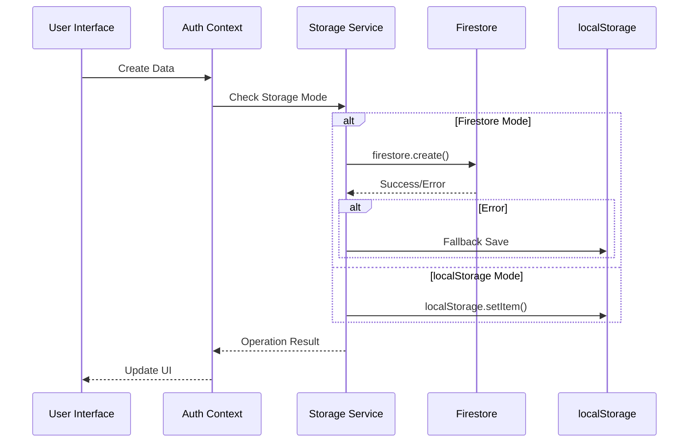
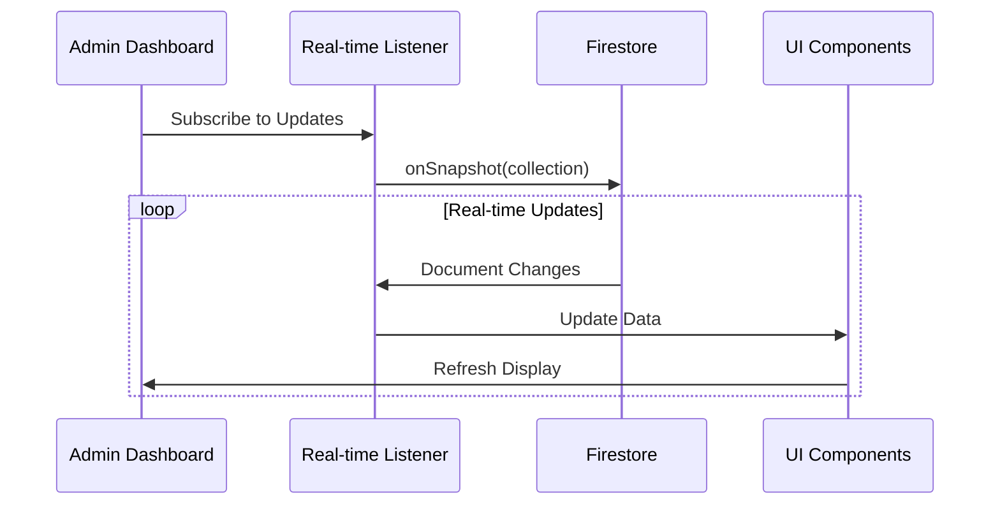

# 🗄️ Verbal Insights - Complete Storage Architecture Flowchart

## 📊 Comprehensive Storage Architecture & Data Flow Diagram

```mermaid
flowchart TD
    %% Application Entry Points
    A[Application Start] --> B{Environment Check}
    B --> B1[Check NEXT_PUBLIC_USE_LOCALSTORAGE]
    B --> B2[Validate Firebase Config]
    
    B1 --> B1_YES{NEXT_PUBLIC_USE_LOCALSTORAGE = 'true'?}
    B1_YES -->|Yes| LS_MODE[🔧 Force localStorage Mode]
    B1_YES -->|No| B2
    
    B2 --> VALIDATE[validateFirebaseConfig()]
    VALIDATE --> CHECK_ENV{Check Environment Variables}
    
    %% Environment Variable Validation
    CHECK_ENV --> ENV_VARS[Required Environment Variables:<br/>• NEXT_PUBLIC_FIREBASE_API_KEY<br/>• NEXT_PUBLIC_FIREBASE_AUTH_DOMAIN<br/>• NEXT_PUBLIC_FIREBASE_PROJECT_ID<br/>• NEXT_PUBLIC_FIREBASE_STORAGE_BUCKET<br/>• NEXT_PUBLIC_FIREBASE_MESSAGING_SENDER_ID<br/>• NEXT_PUBLIC_FIREBASE_APP_ID]
    
    ENV_VARS --> PLACEHOLDER_CHECK{Check for Placeholder Values}
    PLACEHOLDER_CHECK --> PLACEHOLDER_LIST[Placeholder Detection:<br/>• 'your_firebase_api_key_here'<br/>• 'your_project.firebaseapp.com'<br/>• 'your_project_id'<br/>• 'your_project.appspot.com'<br/>• 'your_sender_id'<br/>• 'your_app_id']
    
    PLACEHOLDER_LIST --> VALIDATION_RESULT{All Variables Valid?}
    VALIDATION_RESULT -->|Yes| FIRESTORE_MODE[🔥 Firestore Mode Selected]
    VALIDATION_RESULT -->|No| LS_MODE
    
    %% Storage Mode Configuration
    FIRESTORE_MODE --> STORAGE_NOTIFICATION[📱 Storage Notification Component<br/>Shows: 'Cloud Database' with green icon]
    LS_MODE --> STORAGE_NOTIFICATION_LS[📱 Storage Notification Component<br/>Shows: 'Local Storage' with blue icon]
    
    %% User Interactions Entry Points
    STORAGE_NOTIFICATION --> USER_ACTIONS{User Actions}
    STORAGE_NOTIFICATION_LS --> USER_ACTIONS
    
    USER_ACTIONS --> LOGIN[🔐 User Login]
    USER_ACTIONS --> REGISTER[📝 User Registration]
    USER_ACTIONS --> INTERVIEW[🎤 Interview Recording]
    USER_ACTIONS --> SJT[📋 SJT Test Taking]
    USER_ACTIONS --> ADMIN[👨‍💼 Admin Operations]
    USER_ACTIONS --> CONFIG[⚙️ Configuration Changes]
    
    %% Authentication Flow
    LOGIN --> AUTH_CHECK{Storage Mode Check}
    REGISTER --> AUTH_CHECK
    
    AUTH_CHECK -->|Firestore Mode| AUTH_FIRESTORE[🔥 Firestore Authentication]
    AUTH_CHECK -->|localStorage Mode| AUTH_LOCAL[💾 localStorage Authentication]
    
    %% Firestore Authentication Path
    AUTH_FIRESTORE --> FB_USER_LOOKUP[userService.getByEmail(email)]
    FB_USER_LOOKUP --> FB_AUTH_SUCCESS{User Found & Password Match?}
    FB_AUTH_SUCCESS -->|Yes| SESSION_STORE[Store in localStorage: SESSION_KEY]
    FB_AUTH_SUCCESS -->|No| AUTH_FAIL[❌ Authentication Failed]
    FB_AUTH_SUCCESS -->|Error| FALLBACK_AUTH[⚠️ Fallback to localStorage]
    
    %% localStorage Authentication Path
    AUTH_LOCAL --> LS_USER_LOOKUP[Parse localStorage: USERS_KEY]
    LS_USER_LOOKUP --> LS_AUTH_SUCCESS{User Found & Password Match?}
    LS_AUTH_SUCCESS -->|Yes| SESSION_STORE
    LS_AUTH_SUCCESS -->|No| AUTH_FAIL
    
    FALLBACK_AUTH --> LS_USER_LOOKUP
    
    %% Interview Recording Flow
    INTERVIEW --> MEDIA_CAPTURE[🎥 Media Capture Component]
    MEDIA_CAPTURE --> PERMISSION_CHECK{Check Browser Permissions}
    PERMISSION_CHECK -->|Granted| RECORDING_START[Start MediaRecorder]
    PERMISSION_CHECK -->|Denied| PERMISSION_ERROR[❌ Permission Error]
    
    RECORDING_START --> MEDIA_TYPE{Capture Mode}
    MEDIA_TYPE -->|Audio| AUDIO_STREAM[🎤 Audio Recording<br/>MIME: audio/webm]
    MEDIA_TYPE -->|Video| VIDEO_STREAM[📹 Video Recording<br/>MIME: video/webm]
    
    AUDIO_STREAM --> MEDIA_PROCESSING[Media Processing]
    VIDEO_STREAM --> MEDIA_PROCESSING
    
    MEDIA_PROCESSING --> BLOB_CREATION[Create Blob from MediaRecorder chunks]
    BLOB_CREATION --> DATA_URI[Convert Blob to Data URI]
    DATA_URI --> SIZE_CHECK{isDataUriTooLarge()?<br/>Threshold: 500KB}
    
    %% Media Storage Decision
    SIZE_CHECK -->|< 500KB| SMALL_MEDIA[💾 Store as Data URI in Database]
    SIZE_CHECK -->|> 500KB| LARGE_MEDIA[☁️ Upload to Firebase Storage]
    
    %% Large Media Firebase Storage Flow
    LARGE_MEDIA --> STORAGE_CHECK{Firebase Storage Available?}
    STORAGE_CHECK -->|Yes| FB_STORAGE_UPLOAD[🔥 Firebase Storage Upload]
    STORAGE_CHECK -->|No| FALLBACK_DATAURI[⚠️ Keep as Data URI (Fallback)]
    
    FB_STORAGE_UPLOAD --> BLOB_CONVERT[dataUriToBlob() - Convert to Blob]
    BLOB_CONVERT --> STORAGE_PATH[Generate Storage Path:<br/>submissions/{submissionId}/Q{index}_{mediaType}.webm]
    STORAGE_PATH --> UPLOAD_BYTES[uploadBytes(storageRef, blob)]
    UPLOAD_BYTES --> GET_DOWNLOAD_URL[getDownloadURL(snapshot.ref)]
    GET_DOWNLOAD_URL --> DOWNLOAD_URL[📎 Firebase Storage Download URL]
    
    %% Submission Saving Flow
    SMALL_MEDIA --> SUBMISSION_PREP[Prepare Submission Data]
    DOWNLOAD_URL --> SUBMISSION_PREP
    FALLBACK_DATAURI --> SUBMISSION_PREP
    
    SUBMISSION_PREP --> SUBMISSION_STORAGE{Storage Mode Check}
    SUBMISSION_STORAGE -->|Firestore Mode| FIRESTORE_SAVE[🔥 Save to Firestore]
    SUBMISSION_STORAGE -->|localStorage Mode| LOCALSTORAGE_SAVE[💾 Save to localStorage]
    
    %% Firestore Submission Saving
    FIRESTORE_SAVE --> CANDIDATE_ID[Add candidateId from auth context]
    CANDIDATE_ID --> FIRESTORE_CREATE[submissionService.create(submission)]
    FIRESTORE_CREATE --> FIRESTORE_SUCCESS{Save Successful?}
    FIRESTORE_SUCCESS -->|Yes| REALTIME_UPDATE[📡 Real-time Listeners Triggered]
    FIRESTORE_SUCCESS -->|No| FIRESTORE_FALLBACK[⚠️ Fallback to localStorage]
    
    %% localStorage Submission Saving
    LOCALSTORAGE_SAVE --> LS_SUBMISSIONS[Get from localStorage: SUBMISSIONS_KEY]
    LS_SUBMISSIONS --> GENERATE_ID[Generate ID: sub_{timestamp}_{random}]
    GENERATE_ID --> LS_SAVE_FINAL[Store in localStorage: SUBMISSIONS_KEY]
    
    FIRESTORE_FALLBACK --> LS_SUBMISSIONS
    
    %% Admin Dashboard Data Retrieval
    ADMIN --> ADMIN_OPERATION{Admin Operation Type}
    ADMIN_OPERATION --> VIEW_SUBMISSIONS[📊 View Submissions]
    ADMIN_OPERATION --> MANAGE_USERS[👥 Manage Users]
    ADMIN_OPERATION --> VIEW_CONFIGS[⚙️ View Configurations]
    ADMIN_OPERATION --> DOWNLOAD_MEDIA[📁 Download Media Files]
    
    %% Submissions Retrieval Flow
    VIEW_SUBMISSIONS --> SUBMISSIONS_CHECK{Storage Mode Check}
    SUBMISSIONS_CHECK -->|Firestore Mode| FB_SUBMISSIONS[🔥 Firestore Submissions Retrieval]
    SUBMISSIONS_CHECK -->|localStorage Mode| LS_SUBMISSIONS_GET[💾 localStorage Submissions Retrieval]
    
    FB_SUBMISSIONS --> REALTIME_LISTENER[submissionService.onSubmissionsChange()]
    REALTIME_LISTENER --> FIRESTORE_QUERY[collection(db, 'submissions')]
    FIRESTORE_QUERY --> SNAPSHOT_LISTENER[onSnapshot() - Real-time Updates]
    SNAPSHOT_LISTENER --> SUBMISSIONS_TRANSFORM[Transform Firestore Documents]
    SUBMISSIONS_TRANSFORM --> SUBMISSIONS_SORT[Sort by date (newest first)]
    SUBMISSIONS_SORT --> ADMIN_DISPLAY[📋 Display in Admin Dashboard]
    
    LS_SUBMISSIONS_GET --> LS_PARSE[Parse localStorage: SUBMISSIONS_KEY]
    LS_PARSE --> LS_DISPLAY[📋 Display in Admin Dashboard]
    
    %% Media Download Flow
    DOWNLOAD_MEDIA --> MEDIA_CHECK{Media Type Check}
    MEDIA_CHECK --> DATA_URI_MEDIA[📎 Data URI Media]
    MEDIA_CHECK --> STORAGE_URL_MEDIA[☁️ Firebase Storage URL Media]
    
    DATA_URI_MEDIA --> FETCH_DATAURI[fetch(dataUri) - Convert to Blob]
    STORAGE_URL_MEDIA --> FETCH_STORAGE[fetch(storageUrl) - Download from Firebase]
    
    FETCH_DATAURI --> BLOB_READY[📦 Blob Ready for Download]
    FETCH_STORAGE --> BLOB_READY
    
    BLOB_READY --> ZIP_CREATION[📁 Create ZIP Archive with JSZip]
    ZIP_CREATION --> ZIP_DOWNLOAD[💾 Download ZIP File]
    
    %% User Management Flow
    MANAGE_USERS --> USER_OPERATION{User Operation}
    USER_OPERATION --> CREATE_USER[➕ Create User]
    USER_OPERATION --> UPDATE_USER[✏️ Update User]
    USER_OPERATION --> DELETE_USER[🗑️ Delete User]
    
    CREATE_USER --> USER_STORAGE_CHECK{Storage Mode Check}
    UPDATE_USER --> USER_STORAGE_CHECK
    DELETE_USER --> USER_STORAGE_CHECK
    
    USER_STORAGE_CHECK -->|Firestore Mode| FB_USER_OPS[🔥 Firestore User Operations]
    USER_STORAGE_CHECK -->|localStorage Mode| LS_USER_OPS[💾 localStorage User Operations]
    
    FB_USER_OPS --> FB_USER_SERVICE[userService.create/update/delete()]
    FB_USER_SERVICE --> FB_USER_SUCCESS{Operation Successful?}
    FB_USER_SUCCESS -->|Yes| SESSION_UPDATE[Update Session if Current User]
    FB_USER_SUCCESS -->|No| USER_FALLBACK[⚠️ Fallback to localStorage]
    
    LS_USER_OPS --> LS_USER_PARSE[Parse localStorage: USERS_KEY]
    LS_USER_PARSE --> LS_USER_MODIFY[Modify User Array]
    LS_USER_MODIFY --> LS_USER_SAVE[Save to localStorage: USERS_KEY]
    
    USER_FALLBACK --> LS_USER_PARSE
    
    %% Configuration Management Flow
    CONFIG --> CONFIG_TYPE{Configuration Type}
    CONFIG_TYPE --> JDT_CONFIG[🎯 JDT Configuration]
    CONFIG_TYPE --> SJT_CONFIG[📋 SJT Configuration]
    CONFIG_TYPE --> GLOBAL_CONFIG[🌐 Global Settings]
    
    JDT_CONFIG --> CONFIG_STORAGE_CHECK{Storage Mode Check}
    SJT_CONFIG --> CONFIG_STORAGE_CHECK
    GLOBAL_CONFIG --> CONFIG_STORAGE_CHECK
    
    CONFIG_STORAGE_CHECK -->|Firestore Mode| FB_CONFIG[🔥 Firestore Configuration]
    CONFIG_STORAGE_CHECK -->|localStorage Mode| LS_CONFIG[💾 localStorage Configuration]
    
    FB_CONFIG --> CONFIG_SERVICE[configService.save/getByType()]
    CONFIG_SERVICE --> FB_CONFIG_SUCCESS{Operation Successful?}
    FB_CONFIG_SUCCESS -->|Yes| CONFIG_COMPLETE[✅ Configuration Saved/Retrieved]
    FB_CONFIG_SUCCESS -->|No| CONFIG_FALLBACK[⚠️ Fallback to localStorage]
    
    LS_CONFIG --> CONFIG_KEYS[JDT_CONFIG_KEY / SJT_CONFIG_KEY / GLOBAL_SETTINGS_KEY]
    CONFIG_KEYS --> LS_CONFIG_SAVE[localStorage.setItem() / getItem()]
    LS_CONFIG_SAVE --> CONFIG_COMPLETE
    
    CONFIG_FALLBACK --> CONFIG_KEYS
    
    %% SJT Test Flow
    SJT --> SJT_QUESTIONS[📋 Load SJT Questions]
    SJT_QUESTIONS --> SJT_CONFIG_LOAD[Load SJT Configuration]
    SJT_CONFIG_LOAD --> CONFIG_STORAGE_CHECK
    
    %% Real-time Updates Flow
    REALTIME_UPDATE --> CONNECTED_CLIENTS[📡 All Connected Admin Clients]
    CONNECTED_CLIENTS --> UI_UPDATE[🔄 Live UI Updates]
    UI_UPDATE --> ADMIN_DISPLAY
    
    %% Error Handling & Fallbacks
    FIRESTORE_SUCCESS -->|Connection Error| CONNECTION_FALLBACK[⚠️ Network Error - Fallback to localStorage]
    CONNECTION_FALLBACK --> LS_SUBMISSIONS
    
    %% Data Seeding
    SESSION_STORE --> SEED_CHECK{First Time Setup?}
    SEED_CHECK -->|Yes| DATA_SEEDING[🌱 Seed Default Users]
    SEED_CHECK -->|No| APP_READY[🚀 Application Ready]
    
    DATA_SEEDING --> SEED_ADMIN[👨‍💼 Seed Admin User:<br/>admin@gmail.com / admin123]
    SEED_ADMIN --> SEED_CANDIDATES[👥 Seed Test Candidates:<br/>candidate1@test.com - candidate10@test.com]
    SEED_CANDIDATES --> SEED_STORAGE_CHECK{Storage Mode Check}
    
    SEED_STORAGE_CHECK -->|Firestore Mode| SEED_FIRESTORE[🔥 Seed to Firestore]
    SEED_STORAGE_CHECK -->|localStorage Mode| SEED_LOCALSTORAGE[💾 Seed to localStorage]
    
    SEED_FIRESTORE --> SEED_SUCCESS{Seeding Successful?}
    SEED_SUCCESS -->|Yes| APP_READY
    SEED_SUCCESS -->|No| SEED_FALLBACK[⚠️ Fallback to localStorage Seeding]
    SEED_FALLBACK --> SEED_LOCALSTORAGE
    
    SEED_LOCALSTORAGE --> APP_READY
    
    %% Styling
    classDef firestoreClass fill:#ff6b6b,stroke:#000,stroke-width:2px,color:#fff
    classDef localStorageClass fill:#4ecdc4,stroke:#000,stroke-width:2px,color:#fff
    classDef processClass fill:#45b7d1,stroke:#000,stroke-width:2px,color:#fff
    classDef decisionClass fill:#96ceb4,stroke:#000,stroke-width:2px,color:#000
    classDef errorClass fill:#ffd93d,stroke:#000,stroke-width:2px,color:#000
    classDef mediaClass fill:#6c5ce7,stroke:#000,stroke-width:2px,color:#fff
    classDef successClass fill:#00b894,stroke:#000,stroke-width:2px,color:#fff
    
    class FIRESTORE_MODE,FB_USER_LOOKUP,FIRESTORE_SAVE,FB_SUBMISSIONS,REALTIME_LISTENER,FB_STORAGE_UPLOAD,SEED_FIRESTORE firestoreClass
    class LS_MODE,AUTH_LOCAL,LOCALSTORAGE_SAVE,LS_SUBMISSIONS_GET,LS_CONFIG,SEED_LOCALSTORAGE localStorageClass
    class MEDIA_CAPTURE,AUDIO_STREAM,VIDEO_STREAM,BLOB_CREATION,DATA_URI,DOWNLOAD_MEDIA processClass
    class AUTH_CHECK,SIZE_CHECK,STORAGE_CHECK,SUBMISSIONS_CHECK,CONFIG_STORAGE_CHECK decisionClass
    class PERMISSION_ERROR,AUTH_FAIL,FIRESTORE_FALLBACK,CONNECTION_FALLBACK,USER_FALLBACK errorClass
    class LARGE_MEDIA,SMALL_MEDIA,DATA_URI_MEDIA,STORAGE_URL_MEDIA,FB_STORAGE_UPLOAD mediaClass
    class APP_READY,CONFIG_COMPLETE,ZIP_DOWNLOAD,SESSION_STORE successClass
```

## 📋 Storage Architecture Key Components

### 🔧 **Environment Configuration Detection**
```typescript
// Environment Variable Validation Process
validateFirebaseConfig() {
  checkEnvVars: [
    'NEXT_PUBLIC_FIREBASE_API_KEY',
    'NEXT_PUBLIC_FIREBASE_AUTH_DOMAIN', 
    'NEXT_PUBLIC_FIREBASE_PROJECT_ID',
    'NEXT_PUBLIC_FIREBASE_STORAGE_BUCKET',
    'NEXT_PUBLIC_FIREBASE_MESSAGING_SENDER_ID',
    'NEXT_PUBLIC_FIREBASE_APP_ID'
  ]
  
  detectPlaceholders: [
    'your_firebase_api_key_here',
    'your_project.firebaseapp.com',
    'your_project_id',
    'your_project.appspot.com',
    'your_sender_id',
    'your_app_id'
  ]
  
  return: {
    isValid: boolean,
    storageType: 'firestore' | 'localStorage',
    message: string
  }
}
```

### 🗄️ **Storage Layer Architecture**

#### **Primary Storage (Firestore)**
- **Database**: Firebase Firestore NoSQL database
- **Collections**: 
  - `users` → User accounts and authentication data
  - `submissions` → Interview responses and AI analysis
  - `configurations` → JDT/SJT/Global settings
- **Real-time**: onSnapshot() listeners for live updates
- **Security**: Firestore security rules for access control

#### **Fallback Storage (localStorage)**
- **Keys**:
  - `USERS_KEY` → User data storage
  - `SUBMISSIONS_KEY` → Interview submissions
  - `SESSION_KEY` → Current user session
  - `JDT_CONFIG_KEY` → JDT configuration
  - `SJT_CONFIG_KEY` → SJT configuration
  - `GLOBAL_SETTINGS_KEY` → Global settings
- **Scope**: Browser-specific, device-local storage
- **Persistence**: Survives browser sessions, not shared

### 📁 **Media Storage Strategy**

#### **Small Media Files (< 500KB)**
```typescript
// Stored as Data URI in database
videoDataUri: "data:video/webm;base64,GkXfo..."
```
- **Format**: Base64 encoded data URIs
- **Storage**: Directly in Firestore document or localStorage
- **Retrieval**: Immediate access from database

#### **Large Media Files (> 500KB)**
```typescript
// Uploaded to Firebase Storage
uploadPath: "submissions/{submissionId}/Q{index}_{mediaType}.webm"
downloadURL: "https://firebasestorage.googleapis.com/..."
```
- **Process**: 
  1. Convert Data URI → Blob
  2. Upload to Firebase Storage
  3. Store download URL in database
- **Benefits**: Bypasses Firestore 1MB document limit
- **Fallback**: Keep as Data URI if Firebase Storage fails

### 🔄 **Data Flow Patterns**

#### **Create Operations**


#### **Read Operations with Real-time Updates**


### 🛡️ **Error Handling & Resilience**

#### **Graceful Degradation Pattern**
```typescript
async operation() {
  if (useFirestore()) {
    try {
      return await firestoreService.operation();
    } catch (error) {
      console.error('Firestore failed, falling back:', error);
      return localStorageService.operation();
    }
  } else {
    return localStorageService.operation();
  }
}
```

#### **Connection Resilience**
- **Network Errors**: Automatic fallback to localStorage
- **Permission Errors**: Graceful error messages with fallback
- **Configuration Errors**: Smart detection and appropriate storage selection
- **Browser Compatibility**: Feature detection for storage capabilities

### 📊 **Performance Optimizations**

#### **Media Handling Optimizations**
- **Size Threshold**: 500KB limit for database storage
- **Compression**: WebM format for optimal compression
- **Lazy Loading**: Media files loaded on-demand
- **Caching**: Browser caching for Firebase Storage URLs

#### **Database Query Optimizations**
- **Real-time Listeners**: Only where needed (admin dashboard)
- **Indexed Queries**: Optimized Firestore queries
- **Pagination**: Large datasets handled efficiently
- **Local Caching**: Session storage for frequently accessed data

### 🔐 **Security Considerations**

#### **Data Protection**
- **Environment Variables**: Sensitive configs in environment only
- **API Keys**: Protected Firebase configuration
- **User Data**: Role-based access control
- **Media URLs**: Secure Firebase Storage URLs with access tokens

#### **Access Control**
```javascript
// Firestore Security Rules Example
rules_version = '2';
service cloud.firestore {
  match /databases/{database}/documents {
    // Users can only access their own data
    match /users/{userId} {
      allow read, write: if request.auth.uid == userId;
    }
    
    // Admin access to all data
    match /{document=**} {
      allow read, write: if request.auth.token.role == 'admin';
    }
  }
}
```

This comprehensive flowchart shows every aspect of the storage architecture, from environment detection to media handling, with detailed error handling and fallback mechanisms. The system is designed for resilience, performance, and seamless user experience regardless of the storage backend.
